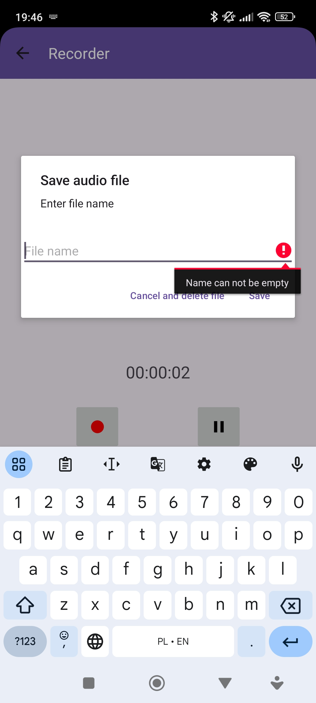

<p align="center">
  
</p>
<h3 align="center">AudioRecorder</h3>
<p align="center">Record and play audio files</p>

<details>
  <summary>Contents</summary>
  <ol>
    <li><a href="#About-project">About project</a></li>
    <ul>
      <li><a href="#Features">Features</a></li>
      <li><a href="#Used-technology">Used technology</a></li>
      <li><a href="#Requirements">Requirements</a></li>
    </ul>
    <li><a href="#Installation">Installation</a></li>
    <li><a href="#License">License</a></li>
  </ol>
</details>


## About project
**AudioRecorder** is Android application for creating and replaying recordings.

<p align="center">
  
  
  
</p>
<p align="center">
  
  
  
</p>


### Features:
- [x] Sign in and sign up with e-mail and password
- [x] Firebase authentication
- [x] Record audio using device microphone
- [x] Replay recorded audio files
- [x] Save and load files from device storage
- [ ] Speech recognition while recording audio


### Used technology:
<table>
  <tr>
    <td></td>
    <td></td>
    <td></td>
  </tr>
  <tr>
    <th>Kotlin</th>
    <th>Android <br/> Studio</th>
    <th>Firebase</th>
  </tr>
</table>


### Requirements:
<details>
  <summary>Required</summary>
  <table>
  <tr>
    <th>Required OS</th>
    <td>Android 12.0 (API lvl 31) and up</td>
  </tr>
  <tr>
    <th>Download size</th>
    <td>15 MB</td>
  </tr>
  <tr>
    <th>Storage</th>
    <td>1 GB available space</td>
  </tr>
  <tr>
    <th>Memory</th>
    <td>2 GB RAM</td>
  </tr>
  <tr>
    <th>App permissions</th>
    <td>Record Audio</td>
  </tr>
  </table>
</details>


## Installation
Download [```app-release.apk```](app/release/app-release.apk) and install on Android device. Because application is installed outside the Google Play Store it will require to confirm installation or scan the game by device.

<!--
## License
TBA -->
